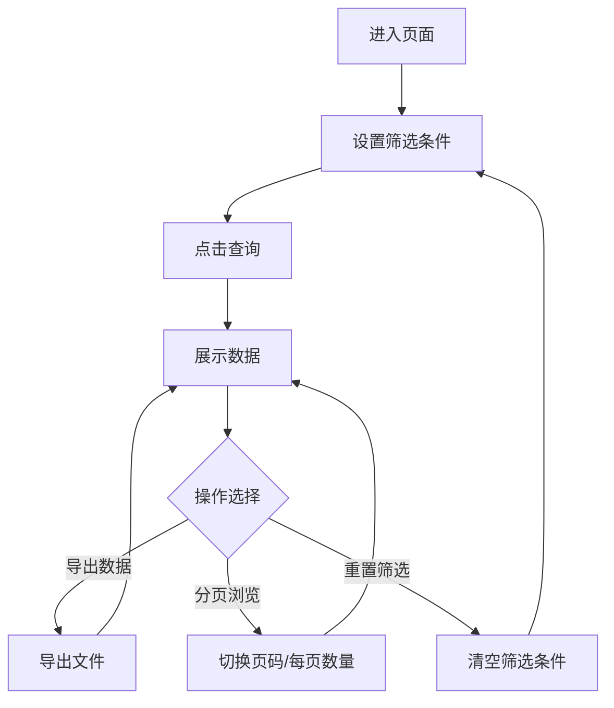

# 常乐豆使用明细页面 PRD 文档

## 1. 产品概览

常乐豆使用明细页面是一个用于查看和管理员工常乐豆使用情况的功能页面，支持多维度筛选、数据导出和分页查询，帮助管理员和员工清晰了解常乐豆的使用记录。

## 2. 核心功能

### 2.1 功能模块

| 模块名称 | 功能描述 |
|---------|--------|
| 搜索筛选 | 支持按月份、使用类型、单号、时间范围、人员信息、部门、岗位、门店、合同主体、状态、账户类型等多维度筛选 |
| 数据展示 | 以表格形式展示常乐豆使用明细，包括交易详情、金额、状态等信息 |
| 数据导出 | 支持将筛选结果导出为文件 |
| 分页功能 | 支持分页浏览数据，可调整每页显示数量 |

### 2.2 页面流程

1. 用户进入常乐豆使用明细页面
2. 设置筛选条件（可选）
3. 点击查询按钮获取符合条件的使用记录
4. 浏览表格数据，可通过分页查看更多记录
5. 点击导出按钮导出当前筛选结果
6. 点击重置按钮清空筛选条件

## 3. 核心流程



## 4. 用户界面设计

### 4.1 布局设计

- 页面整体采用卡片式布局，顶部为卡片标题和导出按钮
- 中部为搜索筛选区域，包含多个表单控件
- 下部为数据表格和分页控件

### 4.2 界面元素

| 元素名称 | 描述 | 位置 |
|---------|------|------|
| 页面标题 | 显示"常乐豆使用明细" | 卡片头部左侧 |
| 导出按钮 | 用于导出数据，带有下载图标 | 卡片头部右侧 |
| 搜索表单 | 包含多个筛选条件的表单 | 卡片中部 |
| 数据表格 | 展示常乐豆使用明细数据 | 卡片下部 |
| 分页控件 | 用于分页浏览数据 | 表格下方右侧 |

### 4.3 响应式设计

- 页面采用响应式布局，适配不同屏幕尺寸
- 在小屏幕设备上，搜索表单会自动调整为垂直排列
- 表格在小屏幕设备上会出现横向滚动条，确保数据完整显示

## 5. 功能详细说明

### 5.1 搜索筛选功能

| 筛选条件 | 类型 | 说明 |
|---------|------|------|
| 月份 | 日期选择器 | 选择特定月份的数据 |
| 使用类型 | 下拉选择 | 可选值：全部、提现、消费、退货 |
| 单号 | 文本输入 | 输入交易单号进行精确匹配 |
| 发起时间 | 日期时间选择器 | 选择交易发起的开始时间 |
| 完成时间 | 日期时间选择器 | 选择交易完成的结束时间 |
| 姓名&工号 | 文本输入 | 输入姓名或工号进行模糊匹配 |
| 部门 | 文本输入 | 输入部门名称进行模糊匹配 |
| 岗位 | 文本输入 | 输入岗位名称进行模糊匹配 |
| 主服务门店 | 文本输入 | 输入主服务门店名称或编码进行模糊匹配 |
| 劳动关系门店 | 文本输入 | 输入劳动关系门店名称或编码进行模糊匹配 |
| 合同主体 | 文本输入 | 输入合同主体名称进行模糊匹配 |
| 状态 | 下拉选择 | 可选值：全部、结算发起、结算成功、结算失败、提现冻结、提现成功、提现失败、消费冻结、消费成功、消费失败、退货中、退货成功、退货失败 |
| 账户类型 | 下拉选择 | 可选值：余额账户 |

### 5.2 数据表格功能

| 字段名称 | 类型 | 说明 |
|---------|------|------|
| 月份 | 文本 | 交易所属月份 |
| 使用类型 | 标签 | 显示交易类型（提现、消费、退货），不同类型显示不同颜色 |
| 单号 | 文本 | 交易单号 |
| 姓名 | 文本 | 员工姓名 |
| 部门 | 文本 | 员工所属部门 |
| 岗位 | 文本 | 员工岗位 |
| 工号 | 文本 | 员工工号 |
| 主服务门店 | 文本 | 员工主服务门店 |
| 劳动关系门店 | 文本 | 员工劳动关系门店 |
| 合同主体 | 文本 | 员工合同主体 |
| 数量 | 文本 | 交易常乐豆数量，提现和消费显示为负数，退货显示为正数 |
| 交易前余额 | 文本 | 交易前的常乐豆余额 |
| 交易后余额 | 标签 | 交易后的常乐豆余额，显示为绿色标签 |
| 账户类型 | 标签 | 账户类型，显示为蓝色标签 |
| 发起时间 | 文本 | 交易发起时间 |
| 完成时间 | 文本 | 交易完成时间 |
| 交易金额 | 文本 | 交易金额 |
| 状态 | 标签 | 交易状态，不同状态显示不同颜色 |

### 5.3 导出功能

- 点击导出按钮可将当前筛选结果导出为文件
- 导出文件包含表格中的所有字段
- 导出格式为常见的办公文件格式（如Excel）

### 5.4 分页功能

- 支持调整每页显示数量（10、20、50、100）
- 支持直接跳转到指定页码
- 显示总记录数

## 6. 数据结构

### 6.1 搜索表单数据结构

```javascript
{
  month: '', // 月份，格式：YYYY-MM
  type: '', // 使用类型：withdrawal, consumption, refund
  orderNo: '', // 单号
  startTime: '', // 发起时间
  endTime: '', // 完成时间
  nameOrId: '', // 姓名或工号
  department: '', // 部门
  position: '', // 岗位
  mainServiceStore: '', // 主服务门店
  laborRelationStore: '', // 劳动关系门店
  contractEntity: '', // 合同主体
  status: '', // 状态
  accountType: 'balance' // 账户类型，默认balance
}
```

### 6.2 表格数据结构

```javascript
[
  {
    month: '2026-03', // 月份
    type: 'withdrawal', // 使用类型
    orderNo: 'WITH2026030001', // 单号
    name: '张三', // 姓名
    department: '技术部', // 部门
    position: '前端开发', // 岗位
    employeeId: '1001', // 工号
    mainServiceStore: '', // 主服务门店
    laborRelationStore: '北京总部', // 劳动关系门店
    contractEntity: '北京常乐健康科技有限公司', // 合同主体
    amount: 500, // 数量
    beforeBalance: 1500, // 交易前余额
    afterBalance: 1000, // 交易后余额
    transactionAmount: 500, // 交易金额
    accountType: 'balance', // 账户类型
    initiateTime: '2026-03-05 10:00:00', // 发起时间
    completeTime: '2026-03-05 10:30:00', // 完成时间
    status: 'success' // 状态
  }
]
```

### 6.3 分页数据结构

```javascript
{
  currentPage: 1, // 当前页码
  pageSize: 10, // 每页显示数量
  total: 100 // 总记录数
}
```

## 7. 业务规则

1. **使用类型规则**：
   - 提现：从账户中扣除常乐豆
   - 消费：从账户中扣除常乐豆
   - 退货：向账户中增加常乐豆

2. **状态规则**：
   - 结算相关：结算发起、结算成功、结算失败
   - 提现相关：提现冻结、提现成功、提现失败
   - 消费相关：消费冻结、消费成功、消费失败
   - 退货相关：退货中、退货成功、退货失败

3. **数据显示规则**：
   - 提现和消费的数量显示为负数
   - 退货的数量显示为正数
   - 不同类型和状态使用不同颜色的标签显示

4. **权限规则**：
   - 普通员工只能查看自己的常乐豆使用明细
   - 管理员可以查看所有员工的常乐豆使用明细

## 8. 技术实现

### 8.1 前端技术栈

- Vue 3 + Composition API
- Element Plus（UI组件库）
- Vue Router（路由管理）

### 8.2 后端API

- 获取常乐豆使用明细列表 API
- 导出常乐豆使用明细 API

### 8.3 数据存储

- 常乐豆使用记录存储在数据库中
- 支持按各种条件查询和筛选

## 9. 测试要点

1. **功能测试**：
   - 验证所有筛选条件是否正常工作
   - 验证表格数据是否正确显示
   - 验证导出功能是否正常
   - 验证分页功能是否正常

2. **性能测试**：
   - 测试大量数据时的加载速度
   - 测试筛选条件组合使用时的响应速度

3. **兼容性测试**：
   - 测试在不同浏览器中的显示和功能
   - 测试在不同屏幕尺寸下的响应式表现

## 10. 上线计划

1. **开发阶段**：
   - 前端页面开发
   - 后端API开发
   - 联调测试

2. **测试阶段**：
   - 功能测试
   - 性能测试
   - 兼容性测试

3. **上线阶段**：
   - 灰度发布
   - 全量发布
   - 监控和优化

## 11. 附录

### 11.1 状态码说明

| 状态值 | 状态文本 | 对应类型 |
|-------|---------|--------|
| settlement_initiated | 结算发起 | 结算 |
| settlement_success | 结算成功 | 结算 |
| settlement_failed | 结算失败 | 结算 |
| withdrawal_frozen | 提现冻结 | 提现 |
| withdrawal_success | 提现成功 | 提现 |
| withdrawal_failed | 提现失败 | 提现 |
| consumption_frozen | 消费冻结 | 消费 |
| consumption_success | 消费成功 | 消费 |
| consumption_failed | 消费失败 | 消费 |
| refund_refunding | 退货中 | 退货 |
| refund_refunded | 退货成功 | 退货 |
| refund_refundFailed | 退货失败 | 退货 |

### 11.2 使用类型说明

| 类型值 | 类型文本 |
|-------|---------|
| withdrawal | 提现 |
| consumption | 消费 |
| refund | 退货 |
| settlement | 结算 |

### 11.3 账户类型说明

| 类型值 | 类型文本 |
|-------|---------|
| balance | 余额账户 |